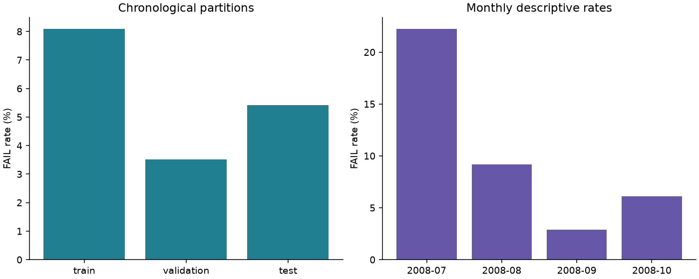
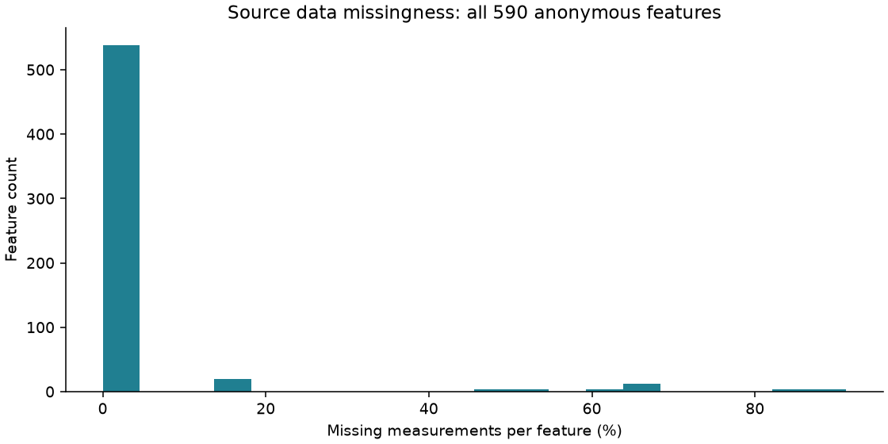
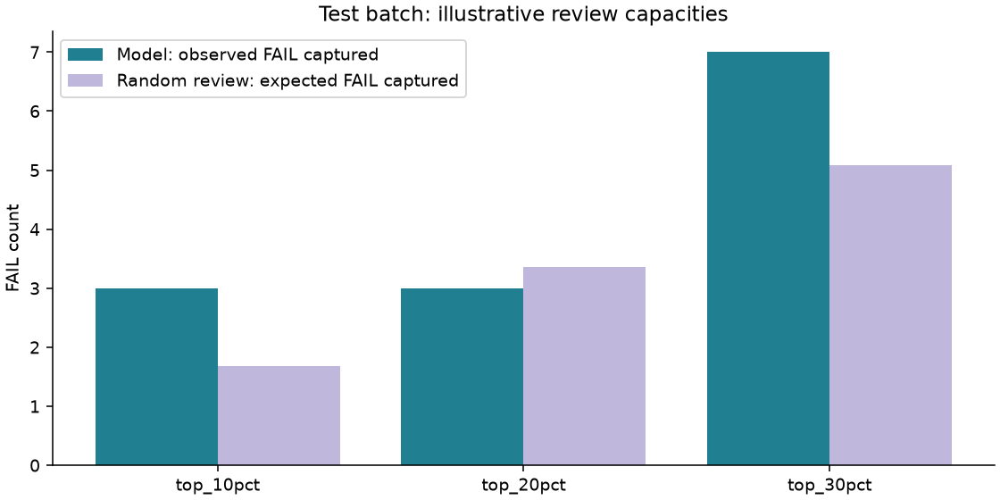
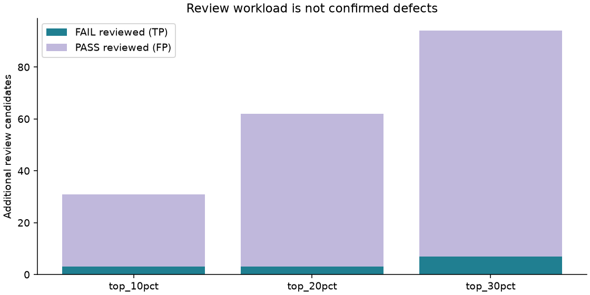

# Semiconductor Quality Decision Lab

**공개 반도체 데이터로 추가 검토 용량과 불량 미포착의 관계를 분석하는 1인 포트폴리오.**

> 결과: 시간순 test 314건(FAIL 17건)에서 상위 20%인 62건을 검토하면 FAIL 3건을 포함하고
> 14건을 놓쳤다. 같은 용량의 무작위 검토 기대값 3.36건보다도 낮았다.
> 이 결과로 모델 기반 검토의 실무 우위를 주장할 수 없다.

상태: **최소 분석 파이프라인 실행·검증 완료 / 해석 Draft / 사용자 검토 대기**.
프로젝트 소유자: Kim Jiseong. Codex 지원 범위는 [AI 사용 기록](docs/AI_USAGE.md)에 공개한다.

[실행 결과](results/baseline/REPORT.md) · [품질 보고서](reports/QUALITY_ENGINEERING_REPORT.md) ·
[실행·검증 기록](docs/VALIDATION_LOG.md) · [개별 예측](results/baseline/predictions.csv) ·
[초기 저장소 점검](docs/REPOSITORY_AUDIT.md)

## 문제정의

**추가 검토할 수 있는 표본 수가 제한될 때, 위험 순위로 어떤 표본을 먼저 확인하며 무엇을 놓치는가?**

정확도만 제시하는 대신 FAIL 포착·미포착, 정상 표본의 추가 검토, 용량 초과를 함께 본다.
검토 후보는 불량 확정·출하 중단 명령이 아니다. 검토에서 빠진 표본도 PASS로 승인하지 않는다.

초기 공동 프로젝트의 질문은 유지하되, 협업자가 필요한 고객 연구와 웨이퍼맵 분석은
이번 구현 범위에서 제외했다. 관련 데이터가 제공되지 않았기 때문이다.
기존 README는 [원문](docs/archive/README.initial.md), 기존 커밋과 문서 경로는 그대로 보존했다.
기존 [SECOM 분석 프로젝트](https://github.com/nickname529/secom-quality-analysis)와 달리
이 저장소는 **시간순 평가와 검토 용량 시나리오**에 집중한다. 기존 성능 결과를 복사하지 않았다.

## 데이터·가용성

[UCI SECOM](https://archive.ics.uci.edu/dataset/179/secom), McCann & Johnston (2008),
[DOI 10.24432/C54305](https://doi.org/10.24432/C54305),
[CC BY 4.0](https://creativecommons.org/licenses/by/4.0/).

| 원본에서 계산한 항목 | 값 |
|---|---:|
| 표본 / 익명 측정 변수 | 1,567 / 590 |
| PASS / FAIL | 1,463 / 104 (FAIL 6.64%) |
| 결측 셀 | 41,951 (4.54%) |
| 관측값 기준 상수 변수 | 116 |
| 완전히 같은 측정 행 | 0 |
| 중복 timestamp에 속한 행 | 65 |

UCI 설명의 591 features와 실제 파일의 590개 측정 열이 다르다. 코드에서는 실제 590개를 사용한다.
원본 `-1=PASS`, `1=FAIL`을 내부 `0/1`로 변환한다. timestamp는 분할에만 사용한다.
공정 이름·단위, lot/batch, 고객, 비용, 실제 검사 용량, 웨이퍼 좌표는 원본에 없다.
SHA-256·다운로드·오프라인 실행 설명은 [데이터 문서](data/README.md)를 참조한다.




## 분석과 의사결정 규칙

[실행 전 기록한 규칙](docs/ANALYSIS_PROTOCOL.md)을 따른다.

1. 원본 ZIP과 추출 파일 해시·차원을 확인하고 전체 기술통계를 계산한다.
2. 시간순 train 940건(FAIL 76), validation 313건(11), test 314건(17)으로 분리한다.
   같은 timestamp는 경계를 넘지 않는다.
3. median 대치 → 분산 0 제거 → 고정 Random Forest를 train에서만 학습한다.
   학습 후 남은 변수는 468개다. 파라미터 탐색·모델 재선택은 수행하지 않는다.
4. 10/20/30% 용량에서 높은 점수부터 `floor(N × 용량)`개를 고른다.
   동점은 원본 row ID 순으로 처리한다.
5. 별도로 validation 점수의 80% quantile `0.188124407`을 test에 고정 적용한다.
   이 정책은 검토 건수 상한을 보장하지 않는다.
6. 무검토·전수검토·무작위 동일 용량의 기대값·상수점수 AP와 비교하고
   예측·분할·결정·모든 결과표를 저장한다.

모든 용량은 **설명을 위한 가정**이다. top-k는 기간 전체 점수가 준비된 뒤 정렬하는
회고적 batch 평가이며 실시간·일별 운영 정책이 아니다. 점수는 보정 불량 확률이 아니다.

## 실제 결과

| test 정책 | 검토 후보 | FAIL 포착 | FAIL 미포착 | PASS 추가 검토 | Recall |
|---|---:|---:|---:|---:|---:|
| 상위 10% | 31 | 3 | 14 | 28 | 17.65% |
| 상위 20% | 62 | 3 | 14 | 59 | 17.65% |
| 상위 30% | 94 | 7 | 10 | 87 | 41.18% |
| validation 고정 임계값 | 77 | 6 | 11 | 71 | 35.29% |
| 무검토 | 0 | 0 | 17 | 0 | 0% |
| 전수검토 | 314 | 17 | 0 | 297 | 100% |

- test AP **0.0850**, 상수점수 AP **0.0541**, ROC-AUC **0.5825**.
- 상위 20% precision **4.84%**. 10%에서 20%로 늘린 추가 31건에는 FAIL이 없었다.
- 상위 20% recall의 Wilson 95% 구간 **6.19–41.03%**. FAIL 17건뿐이며 군집·학습 변동은 반영하지 않는다.
- validation의 20% quantile 기준은 test에서 **77/314=24.52%**를 후보로 잡았다.
  20% 상한 62건보다 15건 많다. 고정 점수 임계값만으로 검토 용량을 보장할 수 없다.
- 일부 용량에서 무작위 기대값보다 높은 포착 수가 나와도 통계적·운영적 우위가 입증된 것은 아니다.




## 재현 방법

Python **3.12**. 프로젝트 루트에서 실행한다. 패키지와 버전은 `requirements-lock.txt`로 고정했다.
최초 데이터 다운로드에만 인터넷이 필요하며 API 키·Gemma·협업자·서버가 필요 없다.

```bash
python3.12 -m venv .venv
.venv/bin/python -m pip install -r requirements-lock.txt
.venv/bin/python scripts/run_analysis.py --download --output results/reproduced
.venv/bin/python scripts/verify_reproduction.py --actual results/reproduced
.venv/bin/python -m pytest -q
.venv/bin/ruff check src scripts tests
.venv/bin/ruff format --check src scripts tests
```

확보한 원본으로 오프라인 실행하려면 `--download`를 생략한다.
결과 폴더가 이미 있으면 덮어쓰지 않고 중단한다. 재실행할 때 `--output results/reproduced-2`처럼
새 경로를 사용한다. 저장소의 `results/baseline/`은 검증된 증거이므로 그대로 보존한다.
PNG는 실행 환경의 폰트·렌더링에 따라 달라질 수 있다. 비교 스크립트는 6개 CSV·요약·원본·코드 해시·패키지 버전을 확인한다.
CI 설정도 포함했지만 원격 GitHub Actions 실행은 아직 하지 않았다.

## 구성과 한계

```text
src/quality_lab/       원본 검증, 분할, 검토 규칙, 분석·보고서 생성
scripts/               한 번에 실행, 저장 결과와 재현 결과 비교
tests/                 누수·용량·원본 변조·결과 재계산 검증
results/baseline/      실제 예측 CSV, 결과표, 메타데이터, 그래프 4개, 보고서
reports/               품질 분석 요약, 고객 위험의 정보 부족 명시
docs/                  문제정의, 분석 규칙, 보존본, AI·검증·판단 기록
```

2008년 공개 익명 데이터에 대한 단일 시간 분할이다. 현재 반도체 생산라인에 대한 검증이 아니다.
기존 SECOM 결과를 알고 설계했으므로 완전히 새로운 blind holdout 연구도 아니다.
숨은 lot/batch 의존성, 낮은 FAIL 수, 기간 변화, 비보정 점수 때문에 현장 일반화는 불명확하다.
변수의 공정 의미·불량 원인, 비용 절감·수율 개선·고객 효과는 확인하지 않았다.

남은 일은 사용자의 코드·결과 해석 검토와 GitHub 반영 승인이다.
외부 현장 데이터 검증과 실제 용량·비용 정의는 운영 주장을 하려면 필요한 후속 과제이며,
현재 포트폴리오의 최소 분석 완료를 위해 자동으로 확장하지 않는다.
